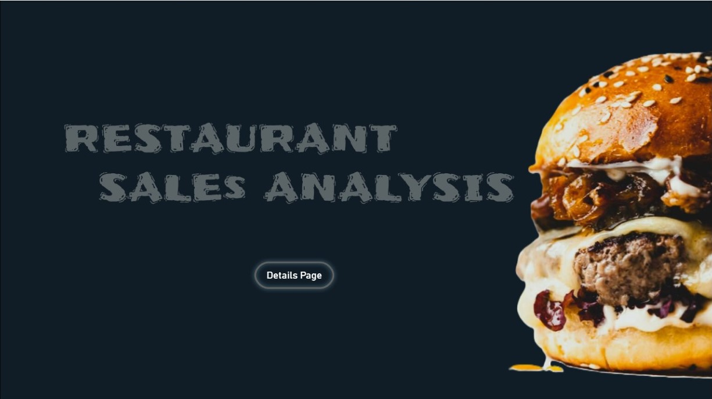
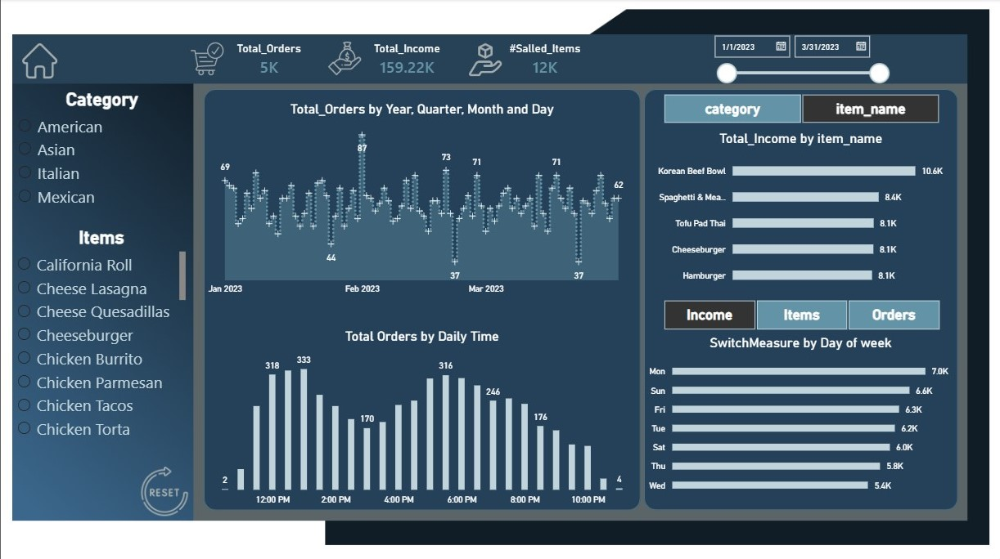

## Restaurant Sales Analysis Dashboard – Power BI

A complete end-to-end restaurant sales analysis dashboard built using Power BI, Power Query, and a custom UI designed in Figma.

# Business Objectives

The goal of this project is to analyze restaurant sales performance, identify top-selling products, 
understand customer purchasing patterns,and provide actionable insights to support business decisions.

🧰 Tools Used

Power BI – Data modeling, DAX, visualization

Power Query – Data cleaning & transformation

Figma – Custom dashboard background design

📊 Key Insights

Total Orders: 5,000

Total Income: 159,220 SAR

Sold Items: 12,000

Peak Hours: 2 PM & 6 PM

Top Items: Korean Beef Bowl, Cheeseburger, Tofu Pad Thai

Best Days: Monday & Sunday

🧹 Data Preparation

Cleaned raw data using Power Query

Removed duplicates, fixed data types, normalized categories

Built a star schema model

Created DAX measures for KPIs and time intelligence

📁 Data Model

A star schema model was built to improve performance and ensure accurate reporting.
Fact and dimension tables were connected using one-to-many relationships.

🎨 Dashboard Design

Custom background created in Figma

Modern clean layout

Consistent spacing, typography, and color palette

Focus on readability and storytelling

📁 Files Included

Restaurant_Sales_Analysis.pbix

Figma background (PNG)

Dashboard screenshots

Data Model (PNG)

📸 Dashboard Preview

Home Page

Details Page

Data Model

## Skills Demonstrated
- Data Cleaning
- Data Modeling
- DAX Measures
- KPI Development
- Dashboard Design
- Data Visualization
- Business Analysis

🌐 Author

Waad Mohsn
Aspiring Data Analyst

Power BI | Excel | Power Query | DAX
